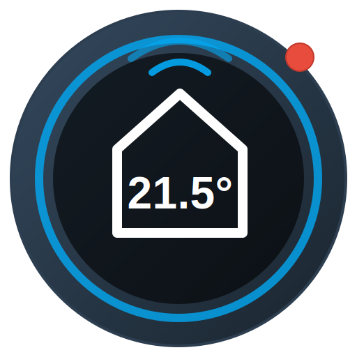
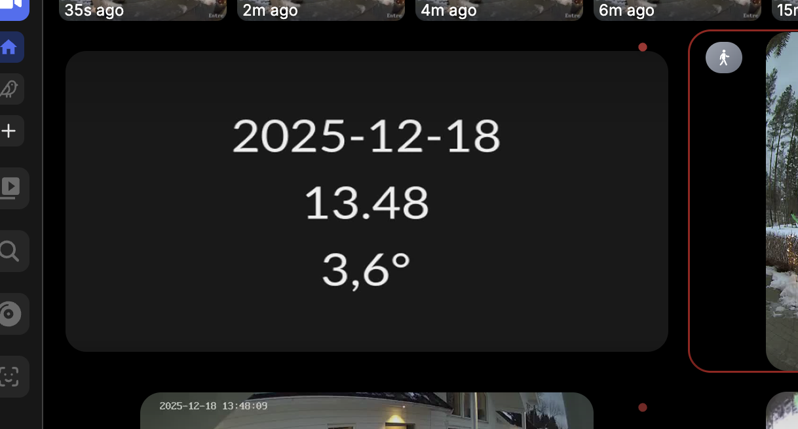

# Home Assistant Sensor Streamer (`ha-sensor-streamer`)



`ha-sensor-streamer` is a lightweight, high-performance Rust application that fetches sensor data from Home Assistant and overlays it onto a generated video stream (MJPEG or RTSP).



This is ideal for integrating non-video data (temperature, power usage, weather, time) into NVR systems like **Frigate**, **Blue Iris**, or **Synology Surveillance Station** that expect video feeds.

## Features

- **Protocol Support**: Streams via **MJPEG** (HTTP) or **RTSP** (TCP).
- **Customizable Overlay**: Configure up to 4 lines of text using templates.
- **Multiple Sensors**: Display data from multiple Home Assistant sensors on a single screen.
- **Template System**: Mix static text, time/date placeholders, and sensor values.
- **Locale Awareness**: Automatically formats numbers (e.g., decimal commas) based on locale settings.
- **Efficient**: Written in Rust using `tokio`, `gstreamer` (RTSP), and `axum` (MJPEG) for low resource usage.

## Configuration

Configuration is handled entirely via environment variables.

### Connection
| Variable | Description | Required | Default |
|----------|-------------|----------|---------|
| `HA_BASE_URL` | URL to your Home Assistant instance (e.g., `http://192.168.1.50:8123`) | Yes | - |
| `HA_LONG_LIVED_TOKEN` | Long-lived access token from Home Assistant | Yes | - |
| `PORT` | Port to listen on (HTTP or RTSP) | No | `8080` |

### Video & Display
| Variable | Description | Default |
|----------|-------------|---------|
| `STREAM_FORMAT` | `mjpeg` or `rtsp` | `mjpeg` |
| `VIDEO_WIDTH` | Width of the generated video | `640` |
| `VIDEO_HEIGHT` | Height of the generated video | `360` |
| `VIDEO_FPS` | Frames per second | `5` |
| `FONT_SIZE` | Font size for text | `48.0` |
| `LOCALE` | Locale for number formatting (e.g., `sv_SE` for commas) | `en_US` |

### Content Templates (`LINE_1` to `LINE_4`)

You can configure up to 4 lines of text. If not set, a default layout (Date, Time, Sensor) is used.

**Placeholders:**
- `{sensor.entity_id}`: Replaced with the state of the specified sensor.
- `{time:FORMAT}`: Replaced with the current time formatted according to [strftime](https://docs.rs/chrono/latest/chrono/format/strftime/index.html).

**Examples:**

```bash
# Example 1: Simple Status
LINE_1="Living Room"
LINE_2="Temp: {sensor.temp_sensor}°C"
LINE_3="Hum: {sensor.humidity_sensor}%"
LINE_4="{time:%H:%M}"

# Example 2: Weather & Time
LINE_1="{time:%A, %d %B}"
LINE_2="{time:%H:%M:%S}"
LINE_3="Outdoor: {sensor.outdoor_temp}"
LOCALE="sv_SE" # Will display decimals as "22,5"
```

## Docker Compose

```yaml
services:
  ha-sensor-streamer:
    image: ghcr.io/tuomaz/ha-sensor-streamer:main
    restart: unless-stopped
    ports:
      - "8080:8080" # MJPEG
      - "8554:8554" # RTSP
    environment:
      - HA_BASE_URL=http://192.168.1.50:8123
      - HA_LONG_LIVED_TOKEN=your_long_token_here
      
      # Video Settings
      - STREAM_FORMAT=rtsp
      - VIDEO_WIDTH=1280
      - VIDEO_HEIGHT=720
      - VIDEO_FPS=5
      
      # Display
      - FONT_SIZE=64.0
      - LOCALE=sv_SE
      
      # Lines
      - LINE_1={time:%Y-%m-%d}
      - LINE_2={time:%H:%M}
      - LINE_3=Temp: {sensor.ute_kombinerad}°C
```

## Running Locally

1. **Prerequisites**:
   - Rust toolchain
   - GStreamer development libraries (for RTSP support)
     - Ubuntu: `sudo apt-get install libgstreamer1.0-dev libgstreamer-plugins-base1.0-dev libgstreamer-plugins-bad1.0-dev`

2. **Run**:
   ```bash
   # Create a .env file with the variables above, or export them
   export HA_BASE_URL="http://localhost:8123"
   export HA_LONG_LIVED_TOKEN="..."
   
   cargo run
   ```

## License

MIT